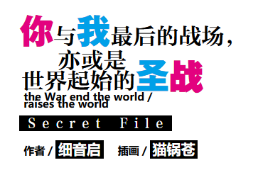

# 灵感

使用tailwindcss来定义一套CSS代码，可以高效地模仿轻小说中标题图HTML页面的制作。

## 权衡

- Vue/Angular/React 组件的样式一般是class中绑定类，然后在`<style>`块书写对应的样式；或者直接写内联style。
- Tailwindcss 可以看作一个巨大的原子类，类似一个 utility.scss，里面定义了非常多的工具类css selector样式，只需要在html中自由组合。
  - 弊端：导致html中css class非常多。可能会造成代码可读性下降。
  - 适用于强规范的项目，否则这种约束名存实亡。
  - 适用于书写库/框架类CSS项目，不太适合写业务界面。

Tailwindcss本质是将css样式，用css 类完全定义一次，后面就只是组合使用。
Tailwindcss不会有button这种类名，而是一堆小的utility类名，例如`text-lg`。

从抽象级别/粒度方面思考：

- 传统的UI框架提供的一般是组件级别的抽象，Tailwindcss提供的是更细粒度的样式抽象。
- 对于需要高度定制的样式，使用Tailwindcss更加合适。对于不需要经常变化的样式，可以使用组件级别的传统UI框架。

Tailwindcss的弊端，没法类似Vue组件那样，提供强有力的行为定义，这个是JS的强项。纯CSS基本没法实现，或者会实现地非常吃力。

边缘场景：加入有一个button用了100遍，后来需要修改了，使用Tailwindcss的话需要逐个去修改Tailwindcss的样式。

这就是组件化和更细粒度抽象级别之间的权衡。定制的灵活度和抽象级别之间，全都要是不可能的。