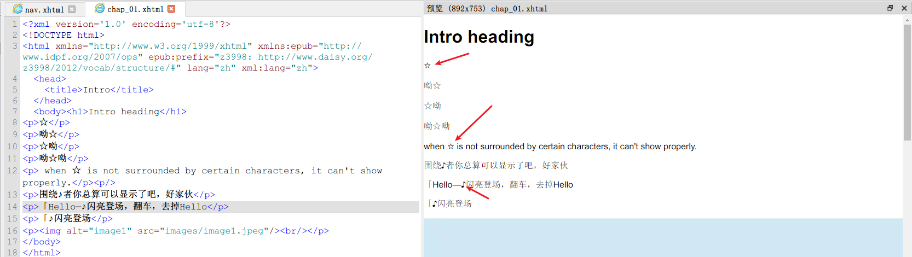
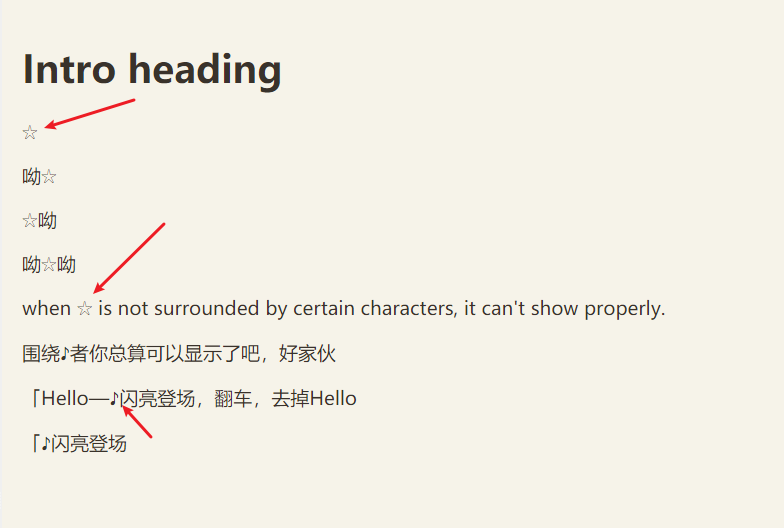

# epub正文存在字符乱码

## 问题描述

这个乱码的情况在sumatraPDF软件中出现。

例如上面的音符，变成了fallback的“口”字形，初步推测是文本编码问题。

应该尝试从字符编码方面入手，来排查问题。


---

并不是所有的星星字符都会乱码。

此时，审查文本源码，发现部分 ☆ 右边没有 `/r`，显示正常，而`☆/r`这种形式则会无法显示。


## 重现问题

为了进一步确认这个问题是否为epub阅读器本身的显示问题。

我决定创建一个简单的epub来重现这个问题，关键python代码：

```python
# create chapter
c1 = epub.EpubHtml(title='Intro', file_name='chap_01.xhtml', lang='zh')
c1.content = """
<h1>Intro heading</h1>
<p>☆</p>
<p>呦☆</p>
<p>☆呦</p>
<p>呦☆呦</p>
<p> when ☆ is not surrounded by certain characters, it can't show properly.<p/>
<p>围绕♪者你总算可以显示了吧，好家伙</p>
<p>「Hello—♪闪亮登场，翻车，去掉Hello</p>
<p>「♪闪亮登场</p>
<p><br/></p>
"""
```

在sumatraPDF V3.5.15227(last commit 8cc46a222e393a56f71918ec262ee8eaff2e08fd)的显示截图如下：


接着，我下载了其他两个epub阅读器，分别是sigil和calibre，下面给出对应的截图：

> Sigil 1.9.10



sigil预览显示正常。

---

> calibre 5.43 64bit



calibre显示正常。

因此，确认是epub阅读器自身带来的显示问题。


## 后续

此问题不是该代码仓库的责任，等待sumatraPDF的修复。