# linovelib PC 端文本字体混淆

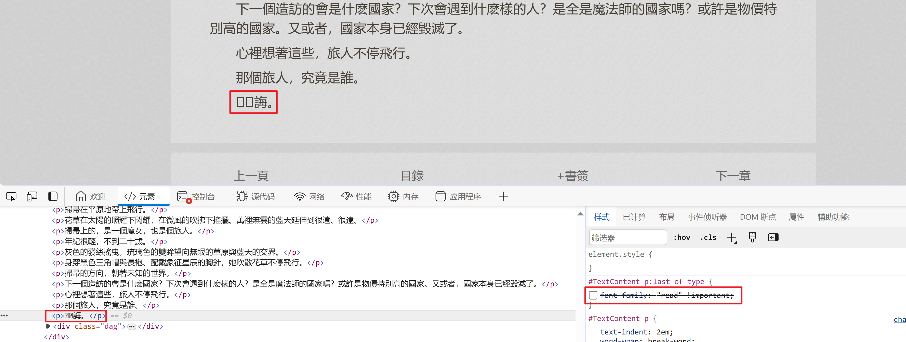

分析这个乱码的 unicode 的具体值。这里使用了 [UTools](https://www.u.tools/) 的 Unicode 插件进行快速转换。

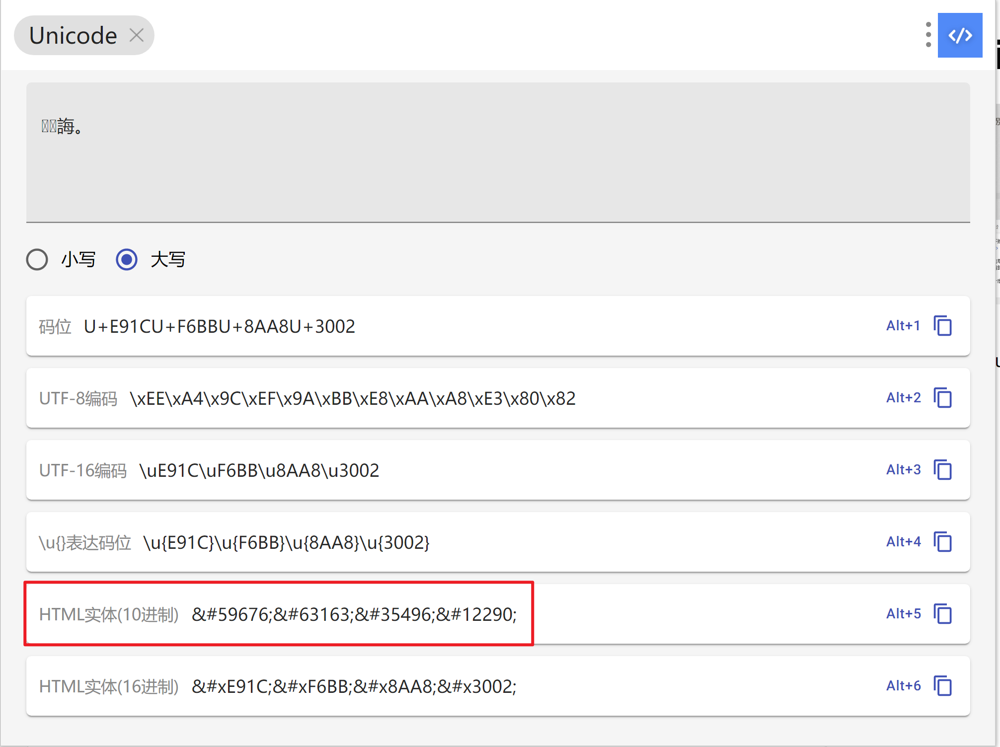

即 ` 誨。` 四个字符分别对应十进制：`&#59676; &#63163; &#35496; &#12290;`

`&#` 是前缀标志，后面的数字就是对应字体文件中定义的代码点（例如 59676）。

我们现在理一下思路方向，我们已经拿到了字体文件，也根据网页的乱码转化出了底层的字形代码点。

** 现在关键就是从字体文件中解析出【字形←→字形代码点】的映射规则，从而根据字形代码点推导出对应的字形。**

## 映射规则分析

以 59676 这首个代码点进行具体说明：

```
网页乱码（） -> 字形代码点（59676） -> 根据映射规则（dict） -> 对应字形（是）
```

为了更好地分析字体的映射，可以下载 [FontCreator](https://www.high-logic.com/font-editor/fontcreator) 这个软件进行字体分析：

1. 导入字体后的初始界面。

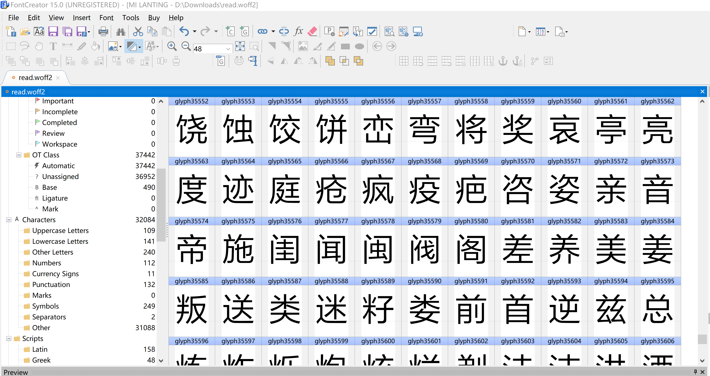

2. 使用 Ctrl+F 进行快速查找，这里需要输出的是十进制的代码点 59676。

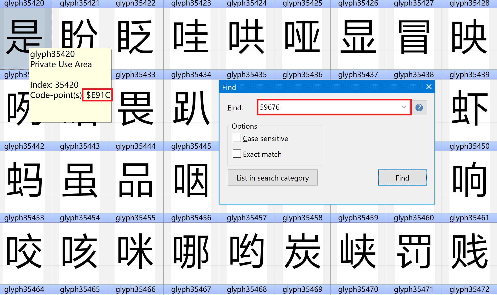

可以看到对应的字符为”是“，它的十六进制代码点为 E91C，等于十进制的 59676。

到了这里，我们的思路就已经很直白了——在 python 代码中解析这个字体文件，提取出字形 - 代码点的映射关系。

## 具体实现

使用 fontTools 第三方 python 库来进行解析：

```python
# pip install fontTools
from fontTools.ttLib import TTFont

read_font = TTFont('read.woff2')
read_font.saveXML('read.xml')
```

read.woff2 本身应该没有经过精简字符范围，文件大小为 1.7MB，而这个 read.xml 文件有 50MB 左右。

因此，直接使用这个 read.xml 会有严重的性能问题。这里需要注意。

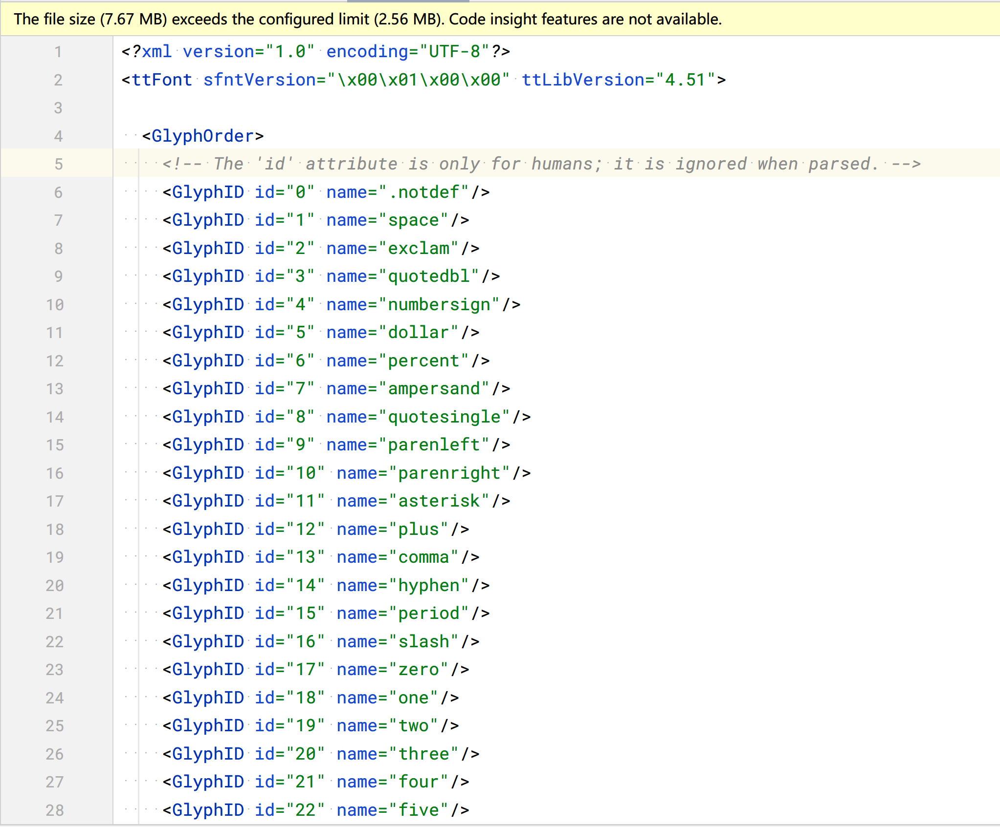

回到“是”这个字符本身，在 read.xml 中进行搜索 E91C，可以得到它的轮廓描述。** 但是我们的目标是想拿到直接的文本「是」。**

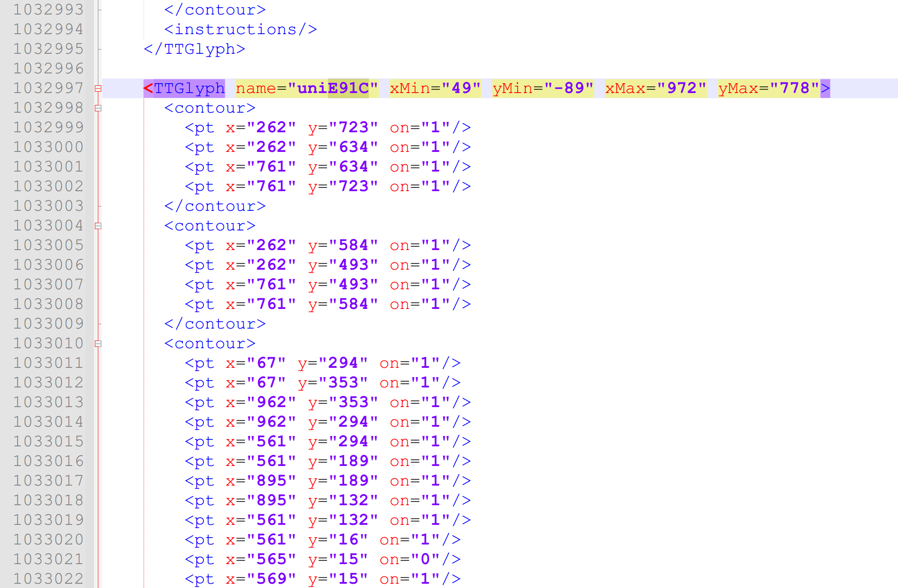

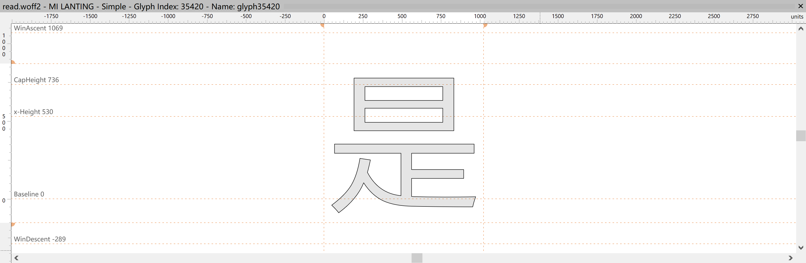

似乎问题变得非常棘手。人的肉眼可以知道这是一个「是」字，但是普通的代码不认识。

- 第一种：从 contour 到字形这一步的识别，比较直接的想法是 OCR。那就是浏览器渲染 -> 区域截图 -> OCR 识别。这种方式比较依赖于
  OCR 库的识别率。
- 第二种：放弃解析字形为文本。原网页是乱码 + 自定义字体，那么爬取后的结果也是乱码 + 字体的组合。这种方式需要妥善处理这个字体的保存和
  CSS 样式应用。
  还有一个弊端，部分 epub 阅读器可能不支持自定义字体的显示。

### 第一种：OCR 解析

我们先来做一个实验，探索一下流程。

```python
from DrissionPage import ChromiumPage

page = ChromiumPage()
url = 'https://www.linovelib.com/novel/2356/83547_6.html'
resp = page.get(url)

last_p = page.ele('css:#TextContent p:last-of-type')

# '诲。'
last_p.get_screenshot()
# refer doc: https://www.drissionpage.cn/ChromiumPage/screen/#%EF%B8%8F%EF%B8%8F-%EF%B8%8F%EF%B8%8F-%E5%85%83%E7%B4%A0%E6%88%AA%E5%9B%BE
bytes_str = last_p.get_screenshot(as_bytes='png')  # 返回截图二进制文本
```

上面这行 `last_p.get_screenshot()` 会保存一个 `p.png` 到当前程序的目录下。内容如下：


而 `last_p.get_screenshot(as_bytes='png')` 适用于在内存中操作这个图片对象，为字节数组形式。

接下来，就是需要进行 OCR 解析了。使用比较著名的 OCR 库 tesseract 进行测试：

```python
from PIL import Image
import pytesseract

# Open the PNG image
image_path = './p.jpg'
image = Image.open(image_path)

print(pytesseract.get_languages())
# ['chi_sim', 'chi_tra', 'eng', 'enm', 'equ', 'osd']

# Perform OCR on the image
text = pytesseract.image_to_string(image, lang='chi_sim+eng')

# strip white space characters
new_text = text.replace(" ", "")
# Print the extracted text
print(new_text)
```

这里首先打印了[支持识别的文本语言](https://tesseract-ocr.github.io/tessdoc/Data-Files-in-different-versions.html)：

| chi_sim | chi_tra | eng | enm                         | equ                              | osd                                     |
|---------|---------|-----|-----------------------------|----------------------------------|-----------------------------------------|
| 中文简体    | 中文繁体    | 英文  | English, Middle (1100-1500) | Math / equation detection module | Orientation and script detection module |

然后在下面的代码识别中，采用组合`chi_sim+eng`来进行识别，因为考虑到轻小说的语言环境，是有可能出现英文的。

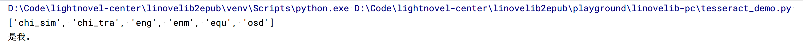

看起来效果不错。现在还有另外一个问题：不是每一个页面都有这个字体混淆，那么该如何判断找出需要进行OCR识别的网页呢？

以[魔女之旅第一卷](https://www.linovelib.com/novel/2356/catalog)
为例，只有个别章节（例如12-14章）的页面存在这个字体混淆，而且目前仅限于某些页面的最后一个段落p，估计是考虑到了性能问题，对方服务器并没有进行大面积的字体混淆。

可以通过[getComputedStyle](https://developer.mozilla.org/en-US/docs/Web/API/Window/getComputedStyle)，即活跃的CSS的样式来进行区分。

| 不存在字体混淆的页面                                                                    | 存在字体混淆的页面                                                                         |
|-------------------------------------------------------------------------------|-----------------------------------------------------------------------------------|
| 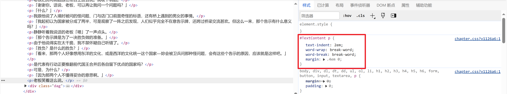                | 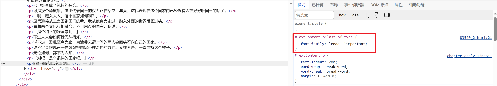                    |
| [魔女之旅 第一卷 第七章 在胜负开始前_哔哩轻小说 ](https://www.linovelib.com/novel/2356/83540.html) | [魔女之旅 第一卷 第七章 在胜负开始前（2）哔哩轻小说 ](https://www.linovelib.com/novel/2356/83540_2.html) |

我们可以通过获取 `#TextContent`这个元素的所有活跃CSS样式来进行判断：

- 如果含有对`#TextContent p:last-of-type`的样式设置，那么认为该页面含有字体混淆；
- 否则，此页面不含有字体混淆。

如此一来，就可以高效区分处理了。判断的JS代码如下：

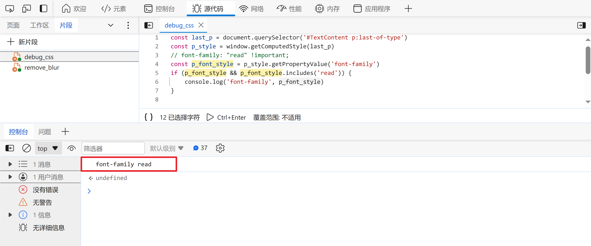

```python
js_check = """
const last_p = document.querySelector('#TextContent p:last-of-type')
const p_style = window.getComputedStyle(last_p)
const p_font_style = p_style.getPropertyValue('font-family')
if (p_font_style && p_font_style.includes('read')) {
    return true;
}
return false;
"""
has_font_obfuscation = page.run_js(js_check)
if has_font_obfuscation:
    print('Has font obfuscation.')
    # do more stuff
else:
    print('No font obfuscation.')
```

### 第二种：原汁原昧保存

暂时不使用这个方案。
