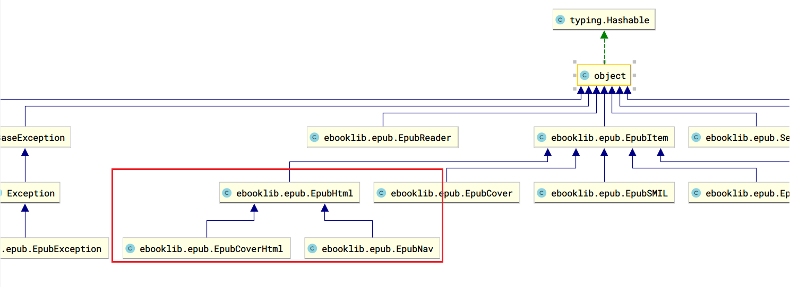

# add css to epub

这个库目前使用的是ebooklib 0.17.1 版本来对epub进行生成。 但是，在实践过程中，发现了许多的不足。


## 分析
对于生成的epub，美化可以从下面的几个方面入手：
- 封面：主要体现在美化封面图片样式(img)，或者自定义一个美观的封面xhtml。
- 版本信息/民间汉化信息：主要体现在文本样式(p)、上下分割线样式。
- 目录：列表样式(ol,ul,li)，以及链接样式(a)。
- 正文：p段落样式，段落首字(dropcap)下沉，段落两个字符单位(2em)缩进。
- 后记：段落p样式。


## 实施

下面将列举使用ebooklib进行**技术可行性检验**时遇到的添加CSS的挑战：

- [x] 为cover.xhtml添加CSS link
- [x] 为nav.xhtml添加CSS link
- [x] 为常规chapter.xhtml添加CSS link

审查ebooklib中源码，分析python类的继承设计。可以看到EpubCoverHtml和EpubNav的确是继承自EpubHtml的。



而EpubHtml具有下面的方法，可以添加CSS和JS的外部声明。

```python
    def add_item(self, item):
        """
        Add other item to this document. It will create additional links according to the item type.

        :Args:
          - item: item we want to add defined as instance of EpubItem
        """
        if item.get_type() == ebooklib.ITEM_STYLE:
            self.add_link(href=item.get_name(), rel='stylesheet', type='text/css')

        if item.get_type() == ebooklib.ITEM_SCRIPT:
            self.add_link(src=item.get_name(), type='text/javascript')
```

但是，在代码中，必须留意【添加NAV的CSS样式】这个步骤与【book初始化添加NCX与NAV】的先后关系：

必须先添加NCX与NAV，然后才能添加NAV的CSS样式。

```py
# add navigation files
book.add_item(epub.EpubNcx())
book.add_item(epub.EpubNav())

# add nav css
nav_style = '''
...
'''
nav_css = epub.EpubItem(uid="style_nav", file_name="style/nav.css", media_type="text/css", content=nav_style)
nav_html = book.get_item_with_id('nav')
nav_html.add_item(nav_css)
book.add_item(nav_css)
```

