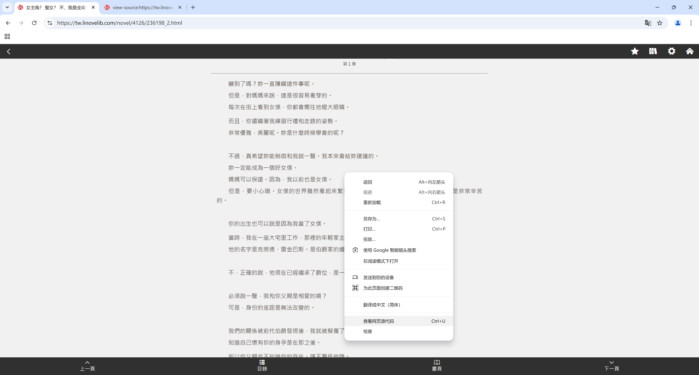
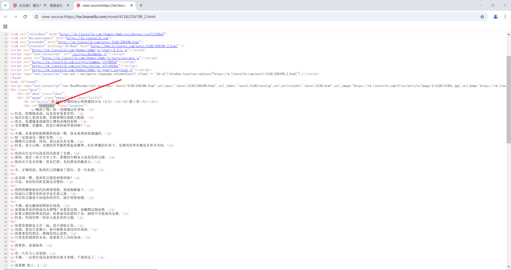

# 普通用户如何获取轻小说正文的容器 ID

找一个你正在爬取的小说的某一卷的某一章的一个网页，在 chrome 中进行访问，下面以 [这个链接](https://tw.linovelib.com/novel/4126/236198_2.html) 为例：

鼠标右键或者（Ctrl + U）查看网页源代码，在正文区域，会有一个这样的id，这就是程序需要的值。

由于网页的结构可能会发生改变，也可能是对方服务器为了反爬虫而给爬虫方出题。当程序过旧，而网页数据过新时，该爬虫就会失败。

修复的方法之一就是：用户主动传递最新的id值告诉爬虫程序。

