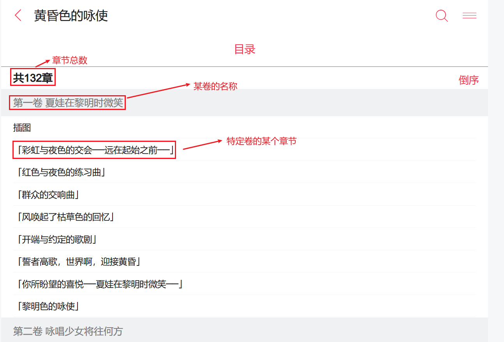
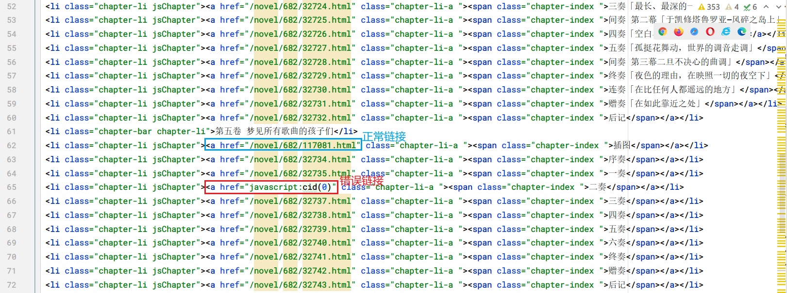
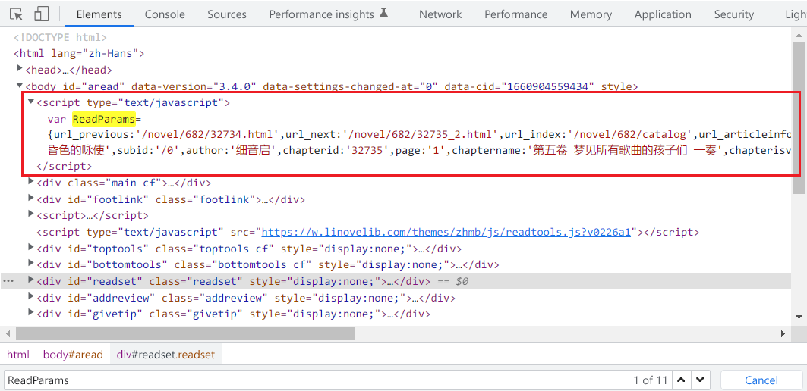

# 流程分析

一共分为两个部分：

- 爬虫（获取数据），
- 创建电子书（转化并导出数据）。

## 爬虫

这里，将以一个具体的例子来进行说明，然后总结流程并考虑其中会遇到的问题。


### 从具体的例子开始

假设我们想要爬取的轻小说URL为：

> https://w.linovelib.com/novel/682.html

其中，682就是轻小说的ID。在浏览器访问这个链接，可以看到如下界面：


从这个界面中，我们可以得到书名，作者名，简介描述，封面图片，以及目录链接。这个五个部分都是我们要获取的数据。

其中，书名，作者名，简介描述，封面图片的获取非常直接，根据HTML标签和CSS类可以唯一地定位到对应的数据。

而目录部分则是需要进一步访问，它的链接为：

> https://w.linovelib.com/novel/682/catalog

也就是在路径`https://w.linovelib.com/novel/682/` 后面加上了 `catalog`的子路径。

访问上述链接后，我们看到如下界面：



从这个界面中，我们可以获取三类重要的信息：

1. 章节总数
2. 卷名称
3. 特定卷的章节名称（点击后可以跳转到具体章节的内容）

也就是说，通过这个目录数据，我们可以逐个爬取每个章节的具体内容，这就是我们需要获取的全部数据了。


### 内容分析

下面我们来分析一下每个章节的内容详情。


一般可以分为两类来讨论：

- 插图章节：内容为图片列表，也有可能含有少量文字。
- 正文章节：图片较少，文字较多。

总之，对于任意一个章节，内容元素要么是图片，要么是文字，没有其它类型。

---

下面是具体的页面源代码分析。

> 插图章节


```html
<div class="divimage">
    
</div>
...
```

图片单元为`class="divimage"`的类所对应的元素。

> 正文章节


正文为p标签数组。p标签的内容有两种：

- 纯文字

  ```html
  <p>
   ... 文字
  </p>
  ```

- img标签，表示内插图。格式如下：

  ```html
  <p>
       
  </p>
  ```

  


### 处理目录中的错误链接



正常的章节链接格式为：`a href="/novel/682/117081.html"`。也就是含有具体章节的合法链接的a标签，才是正常的章节链接。

遇到的错误链接格式为`a href="javascript:cid(0)"`，点击后无法跳转到内容详情页面。

总之，不满足正常链接条件的章节链接，一律视为错误章节链接。

那么问题来了，既然无法直接通过它本身的章节链接（上图中的二奏）进行跳转，那么是否可以考虑间接方式呢？

对于二奏而言，它的上一章是一奏。也就是说，在一奏内容页面，点击“下一章”按钮，应该可以跳转到“二奏”吧？

我们在一奏的页面进行页面源代码分析：


下一页的链接为：

```html
<a onclick="window.location.href = ReadParams.url_next;">下一页</a>
```

点击后，跳转的url来自于这个变量ReadParams中的url_next。这应该是暴露于页面的一个全局变量(Global Variable)，因此我们需要在页面中找到它。



使用 Ctrl+Ｆ键啪的一声（~~很快啊~~）输入`ReadParams`，瞬间定位到了它的位置。它是通过一个script进行js变量暴露。

我们对这个ReadParams进行格式化：

```js
var ReadParams = {
    url_previous: '/novel/682/32734.html',
    url_next: '/novel/682/32735_2.html',   <------------显然，这个就是我们想要的章节链接
    url_index: '/novel/682/catalog',
    url_articleinfo: '/novel/682.html',
    url_image: 'https://w.linovelib.com/files/article/image/0/682/682s.jpg',
    url_home: 'https://w.linovelib.com/',
    articleid: '682',
    articlename: '黄昏色的咏使',
    subid: '/0',
    author: '细音启',
    chapterid: '32735',
    page: '1',
    chaptername: '第五卷 梦见所有歌曲的孩子们 一奏',
    chapterisvip: '0',
    userid: '0',
    readtime: '1660904571'
}
```

这个变量的值是一个对象，里面的url_next这个键的值就是代表它下一个页面的链接。

当代码循环中遇到 `a href="javascript:cid(0)`时，说明当前迭代的chapter链接破损，此时可以选取**上一章的最后一页的“下一章”这个值来进行替换**。

也就是说，我们可以使用这种迂回的方式，来间接地修复之前目录中少部分错误的章节链接。可以预见，这会增加后续编程实现时的代码量，但这的确是一个可行的方法。

现在，还剩下最后一个关键点。

**每一个章节，有可能是多页，也可能是单页。**

- 一般情况下是多页，因为一个章节的内容较多，一个页面是放不下的。例如正文章节。

  对应这种url格式：`/novel/682/32735_2.html`，页面会显示”下一页“按钮。

- 插图章节，一般是单页。

  对应这种url格式： https://w.linovelib.com/novel/682/117077.html 其中不会存在`/novel/682/117077_2.html` 这种格式，只会在页面显示“下一章”按钮。

现在，我们梳理了爬虫的整个流程，也从理论上解决了遇到的目录错误链接的问题。接下来，就可以开始爬虫部分的编程实现了。


### 代码实现

在编码之前，我们再次明确目标：获取特定轻小说的所需的全部内容，分别是书名，作者名，简介描述，封面图片，以及目录链接。

步骤：

1. 获取书籍的基本信息（除开目录）
2. 获取书籍目录信息
3. 根据目录信息获取书籍正文内容

---

上图显示的只是临时的目录数据，因为每个章节的分页链接还没有处理。

未展开分页链接前：

```json
    [
      '夜奏 「你在黎明时微笑」',
      'https://w.linovelib.com/novel/682/32795.html',
    ]
```

展开分页链接后：

```json
    [
      '夜奏 「你在黎明时微笑」',
      'https://w.linovelib.com/novel/682/32795.html',
      'https://w.linovelib.com/novel/682/32795_2.html',
      'https://w.linovelib.com/novel/682/32795_3.html',
      'https://w.linovelib.com/novel/682/32795_4.html',
      'https://w.linovelib.com/novel/682/32795_5.html',
      'https://w.linovelib.com/novel/682/32795_6.html'
    ]
```

而这个形式，正是我们想要得到的最终目录形式，包含了完整而详细的每一页的链接。

我们只需要对每一页的内容进行抓取，就能取得这本书完整的内容。对于每一页中出现的图片链接，可以在后续进行下载。


## 创建电子书

使用 ebooklib。