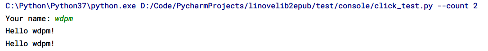

# python 美化控制台输出


## rich：完美而强大的python文本输出工具

因为rich功能过于强大，在另外一个文件中说明。


## terminaltables：文本表格

terminaltables: 纯文本Ascii形式输出表格。

```bash
+Jetta SportWagen------+--------------------------+
| Platform | Years     |                    Notes |
+----------+-----------+--------------------------+
| Mk5      | 2007-2009 | The Golf Mk5 Variant was |
|          |           |      introduced in 2007. |
| MKVI     | 2009-2013 |   Might actually be Mk5. |
+----------+-----------+--------------------------+
```

## tqdm：文本进度条

```python
import time

from tqdm import tqdm

for i in tqdm(range(100)):
    time.sleep(0.2)
```

以文本形式打印进度条。

```
 25%|██▌       | 25/100 [00:05<00:15,  4.99it/s]
```

## colorma：彩色文本

彩色文本。

```python
from colorama import Fore, Style

print('this is not in color')
print(Fore.GREEN + 'this is in green!')
print(Fore.RED + 'this is red!')
print(Style.RESET_ALL + 'this is grey again :(')
```

```bash
this is not in color
this is in green!
this is red!
this is grey again :(
```


## simple_term_menu: 简单的命令行菜单

> NotImplementedError: "Windows" is currently not supported.

```python
from simple_term_menu import TerminalMenu

menu = TerminalMenu(['yes', 'no', 'maybe', 'so'])
menu.show()
```


## click：命令行界面创建工具包

click 用于为python创建漂亮的command line界面。




## tabulate：准确地输出表格数据

```py
import tabulate
data = [
    ['id', 'name', 'number'],
    [0, 'Jeff', 1234],
    [1, 'Bob', 5678],
    [2, 'Bill', 9123]
]
results = tabulate.tabulate(data)
print(results)

# --  ----  ------
# id  name  number
# 0   Jeff  1234
# 1   Bob   5678
# 2   Bill  9123
# --  ----  ------
```
