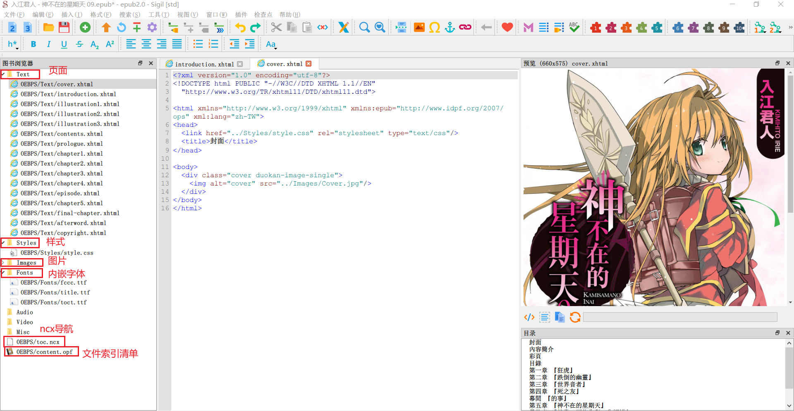

# what is epub3

本文目的在于描述epub3的源码目录结构，为后面的epub文件制作和格式美化奠定牢固的基础。

接下来使用sigil 1.9.10进行说明。

- 首先，将列举epub内部的文件目录组织结构。
- 然后，阐述不同文件目录之间的联系，以及一些重要元数据文件的内容格式。


## epub内部的文件目录结构



- Text：书籍的页面文件夹。里面每一个xhtml文件对应着一个网页。真实的文件路径应该是`/Text/xxx.xhtml`。
- Styles：样式的文件夹。里面存放CSS文件列表，这些CSS文件可能被一些页面所使用。
- Images：插图文件夹。存放图片文件，文件路径举例：`/Images/xxx.png`。

- Fonts：字体文件夹。存放字体文件，目前otf，ttf和woff格式都被支持。
- 其余文件夹暂时请忽略。
- toc.ncx：目录导航文件，目录这部分内容（TOC）就是由它生成的。后续会详细讲解它的内容格式。
- content.opf：open package format。书本的重要附加的数据都在这里，非常关键。


## content.opf

```xml
<?xml version="1.0" encoding="utf-8"?>
<package version="2.0" unique-identifier="BookId" xmlns="http://www.idpf.org/2007/opf">
  <metadata xmlns:dc="http://purl.org/dc/elements/1.1/" xmlns:opf="http://www.idpf.org/2007/opf">
     ...
  </metadata>
  <manifest>
    ...
  </manifest>
  <spine toc="ncx">
    ...
  </spine>
  <guide>
    ...
  </guide>
</package>
```

这个文件类似xml语法。父标签为package，里面含有四个直接的子元素，分别是metadata，manifest，spine，guide。

- metadata里面包含元数据，
- mainifest定义了资源的引用，
- spine定义了书籍的页面排列组织顺序，
- guide定义了额外的导航链接信息。


### metadata

```xml
    <dc:title>神不在的星期天 09</dc:title>
    <dc:creator opf:file-as="入江君人" opf:role="aut">入江君人</dc:creator>
    <dc:publisher>台湾角川</dc:publisher>
    <dc:date>2021-07-20T16:00:00+00:00</dc:date>
    <dc:date>2014-12-23T16:00:00+00:00</dc:date>
    <dc:identifier id="BookId" opf:scheme="UUID">urn:uuid:64c3bcd9-e223-40b3-a7a3-fef601f79808</dc:identifier>
    <dc:description>....(已省略)</dc:description>
    <dc:subject>爱情</dc:subject>
    <dc:subject>超自然</dc:subject>
    <dc:subject>神秘</dc:subject>
    <dc:contributor opf:role="bkp">calibre (5.36.0) [https://calibre-ebook.com]</dc:contributor>
    <dc:language>zh-CN</dc:language>
    <dc:identifier opf:scheme="calibre">2c467ae2-a939-4628-a5bd-837ec9fcbca6</dc:identifier>
    <meta content="0.9.9" name="Sigil version"/>
    <meta content="神不在的星期天 09" name="calibre:title_sort"/>
    <meta content="神不在的星期天" name="calibre:series"/>
    <meta content="9.0" name="calibre:series_index"/>
    <meta content="{&quot;入江君人&quot;: &quot;&quot;}" name="calibre:author_link_map"/>
    <meta name="cover" content="id18"/>
```

主要含有两类信息，一类是DC:field的元数据，一类是meta标签的元数据。本质两种都是元数据。


### mainifest

```xml
<!-- 网页 -->
<item id="cover.xhtml" href="Text/cover.xhtml" media-type="application/xhtml+xml"/>
<item id="introduction.xhtml" href="Text/introduction.xhtml" media-type="application/xhtml+xml"/>
<item id="illustration1.xhtml" href="Text/illustration1.xhtml" media-type="application/xhtml+xml"/>
<item id="illustration2.xhtml" href="Text/illustration2.xhtml" media-type="application/xhtml+xml"/>
<item id="id27" href="Text/illustration3.xhtml" media-type="application/xhtml+xml"/>
<item id="contents.xhtml" href="Text/contents.xhtml" media-type="application/xhtml+xml"/>
<item id="id28" href="Text/prologue.xhtml" media-type="application/xhtml+xml"/>
<item id="chapter1.xhtml" href="Text/chapter1.xhtml" media-type="application/xhtml+xml"/>
<item id="chapter2.xhtml" href="Text/chapter2.xhtml" media-type="application/xhtml+xml"/>
<item id="id15" href="Text/chapter3.xhtml" media-type="application/xhtml+xml"/>
<item id="id16" href="Text/chapter4.xhtml" media-type="application/xhtml+xml"/>
<item id="id" href="Text/episode.xhtml" media-type="application/xhtml+xml"/>
<item id="id23" href="Text/chapter5.xhtml" media-type="application/xhtml+xml"/>
<item id="id17" href="Text/final-chapter.xhtml" media-type="application/xhtml+xml"/>
<item id="postscript.xhtml" href="Text/afterword.xhtml" media-type="application/xhtml+xml"/>
<item id="information.xhtml" href="Text/copyright.xhtml" media-type="application/xhtml+xml"/>

<!-- ncx -->
<item id="ncx" href="toc.ncx" media-type="application/x-dtbncx+xml"/>

<!-- CSS -->
<item id="style.css" href="Styles/style.css" media-type="text/css"/>

<!-- images -->
<item id="id2" href="Images/001.jpg" media-type="image/jpeg"/>
...(省略部分图片)
<item id="id26" href="Images/final-chapter.jpg" media-type="image/jpeg"/>
<item id="zhu.png" href="Images/zhu.png" media-type="image/png"/>

<!-- fonts -->
<item id="id1" href="Fonts/fccc.ttf" media-type="application/x-font-truetype"/>
<item id="title.ttf" href="Fonts/title.ttf" media-type="application/x-font-truetype"/>
<item id="toct.ttf" href="Fonts/toct.ttf" media-type="application/x-font-truetype"/>
```

这里每一项都含有id，href，media-type三个属性，其中href表示相对路径格式的文件路径，media-type指明文件类型。

注意到这里有一个ncx类型，这是关于目录导航文件的，也是epub2规范的遗产，虽然已经过时，但是为了保证向后兼容性，务必添加。


### spine

```xml
<itemref idref="cover.xhtml"/>
<itemref idref="introduction.xhtml"/>
<itemref idref="illustration1.xhtml"/>
<itemref idref="illustration2.xhtml"/>
<itemref idref="id27"/>
<itemref idref="contents.xhtml"/>
<itemref idref="id28"/>
<itemref idref="chapter1.xhtml"/>
<itemref idref="chapter2.xhtml"/>
<itemref idref="id15"/>
<itemref idref="id16"/>
<itemref idref="id"/>
<itemref idref="id23"/>
<itemref idref="id17"/>
<itemref idref="postscript.xhtml"/>
<itemref idref="information.xhtml"/>
```

spine的英文含义是脊柱，在书籍这个领域，它表示的是内容组织的顺序，上面的itemref指向的文件列表，如果从上往下逐个渲染出来，就是最终书本内容的顺序。


### guide

```xml
<reference type="toc" title="目錄" href="Text/contents.xhtml"/>
<reference type="cover" title="封面" href="Text/cover.xhtml"/>
```

这个guide部分可以省略。这里定义了toc和cover的对应文件路径的链接。


## toc.ncx

```xml
<?xml version='1.0' encoding='utf-8'?>
<ncx xmlns="http://www.daisy.org/z3986/2005/ncx/" version="2005-1" xml:lang="zh">
  <head>
    <meta name="dtb:uid" content="urn:uuid:64c3bcd9-e223-40b3-a7a3-fef601f79808"/>
    <meta name="dtb:depth" content="2"/>
    <meta name="dtb:generator" content="calibre (5.36.0)"/>
    <meta name="dtb:totalPageCount" content="0"/>
    <meta name="dtb:maxPageNumber" content="0"/>
  </head>
  <docTitle>
    <text>神不在的星期天 09</text>
  </docTitle>
  <navMap>
    <navPoint id="num_1" playOrder="1">
      <navLabel>
        <text>封面</text>
      </navLabel>
      <content src="Text/cover.xhtml"/>
    </navPoint>
     ...(省略部分)
    <navPoint id="num_12" playOrder="12">
      <navLabel>
        <text>後記</text>
      </navLabel>
      <content src="Text/afterword.xhtml"/>
    </navPoint>
    <navPoint id="num_13" playOrder="13">
      <navLabel>
        <text>轉載信息</text>
      </navLabel>
      <content src="Text/copyright.xhtml"/>
    </navPoint>
  </navMap>
</ncx>
```

- docTitle 定义了目录的标题
- navMap：里面含有多个navPoint元素。这些navPoint元素有序排列，从上往下（由playOrder="?"指定）。
  - navPoint含有navLabel和content子元素，分别用于显示链接文本和定义链接文件的路径。


## CSS样式美化

以cover.xhtml为例子进行说明：

```xml
<?xml version="1.0" encoding="utf-8"?>
<!DOCTYPE html PUBLIC "-//W3C//DTD XHTML 1.1//EN"
  "http://www.w3.org/TR/xhtml11/DTD/xhtml11.dtd">

<html xmlns="http://www.w3.org/1999/xhtml" xmlns:epub="http://www.idpf.org/2007/ops" xml:lang="zh-TW">
<head>
  <link href="../Styles/style.css" rel="stylesheet" type="text/css"/>
  <title>封面</title>
</head>

<body>
  <div class="cover duokan-image-single">
    
  </div>
</body>
</html>
```

留意这行:

```html
<link href="../Styles/style.css" rel="stylesheet" type="text/css"/>
```

它指向了一个CSS文件。CSS文件内容就是网页样式，这里我们省略了对CSS规则的分析。


## 小结

epub中opf定义了附加的数据清单，ncx定义了导航文件，类似网页一样使用css来进行样式美化。

